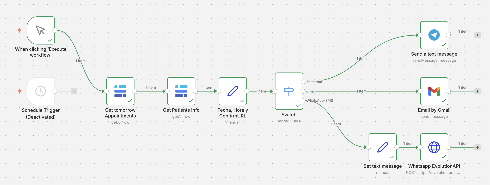
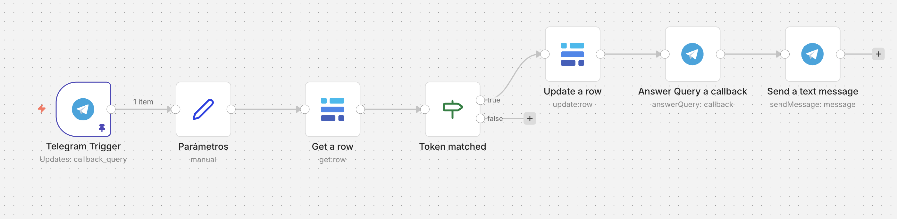
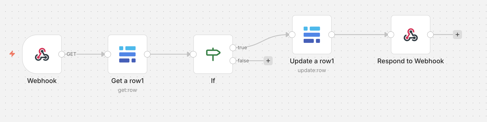

# Omnichannel Reminder Engine: Reducing No-Shows with Automation 🏥

This repository features a robust multi-channel notification system designed to ensure patients never miss an appointment. It automates the "last mile" of the patient journey: the 24-hour reminder and attendance confirmation.

## ⚙️ Key Technical Features

* **Intelligent Multi-Channel Routing:** Uses a `Switch` logic to detect available contact methods (WhatsApp, Telegram, or Email) and sends the reminder through the most effective channel for each patient.
* **Secure Confirmation Tokens:** Generates unique `cita_token` identifiers for each appointment. This ensures that confirmations via Email or Telegram are secure and correctly mapped to the specific record in **Baserow (PostgreSQL)**.
* **Dynamic Webhook Listeners:** Two dedicated sub-workflows act as listeners:
    * **Telegram Callback:** Processes "Confirm" button clicks directly within the chat.
    * **Email Webhook:** Handles link clicks through a personalized HTML landing page.
* **Automated Status Sync:** Once a patient confirms, the system instantly updates the database status to "Confirmed," giving the clinic real-time visibility of their daily agenda.

## 🛠️ Tech Stack
* **Orchestrator:** n8n.
* **Database:** Baserow (PostgreSQL).
* **Channels:** EvolutionAPI (WhatsApp), Telegram Bot API, Gmail API.
* **Logic:** JavaScript (Date formatting & Token validation).

## 📊 Visual Proof & Channel Previews

### 1. Main Orchestration Workflow
The engine fetches tomorrow's schedule and dispatches personalized messages across all platforms.

### 2. Multi-Channel Experience
The patient receives a professional, branded reminder regardless of the platform.
| WhatsApp | Telegram | Email |
| :---: | :---: | :---: |
|  |  |  |

### 3. Automated Confirmation Logic
Dedicated workflows to handle incoming confirmations from Telegram and Email links.

## 🚀 Business Impact
* **Drastic No-Show Reduction:** Proactive confirmation allows clinics to re-assign cancelled slots 24 hours in advance.
* **Unified Patient Data:** All confirmations, regardless of the channel, centralize in the same database for the administrative staff.
